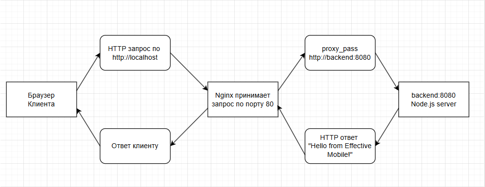

# Тестовое задание DevOps — Effective Mobile

# Описание проекта

Простое веб-приложение, развёрнутое с помощью Docker Compose.  
- Backend (Node.js) слушает порт `8080` и возвращает текст "Hello from Effective Mobile!".  
- Nginx выступает в роли reverse proxy: принимает запросы на порту `80` и перенаправляет их на backend.  
- Backend недоступен с хоста напрямую — только через nginx.

# Использованные технологии

- Docker
- Docker Compose
- Node.js (образ `node:22-alpine`)
- Nginx (образ `nginx:alpine`, собранный с кастомным конфигуратором)

# Как запустить проект

Клонируйте репозиторий:
   ```bash
git clone https://github.com/Ih0rn/EffectiveMobile.git
```
   Перейдите в папку с проетом
   и введите команду в терминале
```bash
docker-compose up --build
```

   Для проверки результата необходимо выполнить команду 
```bash
curl http://localhost
```

# Краткая схема работы (nginx → backend):

Nginx слушает порт 80 и пробрасывает его на хост.

При входящем запросе GET / nginx проксирует его на backend по адресу http://backend:8080.

Backend слушает порт 8080 только внутри Docker-сети и отвечает текстом `"Hello from Effective Mobile!"`.

Nginx возвращает этот ответ клиенту.

Порт 8080 backend-а не доступен с хоста – взаимодействие возможно только через nginx внутри общей сети app-network.
